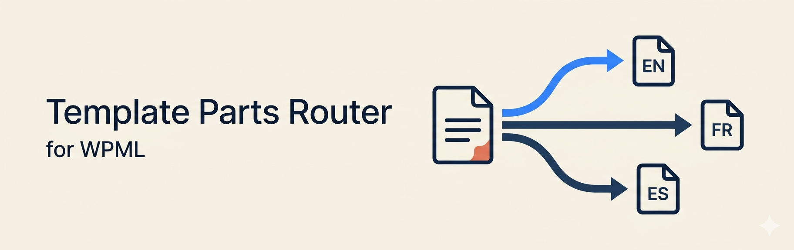

# Template Parts Router

A drop-in WordPress block that renders the right language variant of a template part based on the active language — using a file-per-language convention instead of database-stored translations.

Works with WPML, Polylang, or plain WordPress (falls back to `get_locale()`). If you build block themes, version-control them, and use Create Block Theme to keep files in sync with the editor, this plugin keeps your source of truth on disk.

## Why this exists

Most multilingual plugins translate template parts by storing per-language copies in the `wp_posts` table. Theme authors who treat files as the source of truth — for git history, code review, CI, theme distribution, or Create Block Theme round-trips — lose that source of truth the moment a translator opens the editor. The translated copy lives only in the database, and exporting the theme collapses everything back to a single file.

Template Parts Router takes the opposite approach. You keep one template part file per language on disk. A single router block, dropped into the canonical template part, picks the right file at render time. Your multilingual plugin stays out of template-part resolution entirely.

## At a glance

- **One block, no per-slot setup.** Drop `tp-router/router` into any template part.
- **File-based.** Variants live as `parts/{slug}-{lang}.html` next to your other template parts. CBT round-trips just work.
- **Auto-detects the surrounding slot.** Inside `parts/footer.html`, the router infers `footer` automatically. Override with `baseSlug` only if you need to.
- **Native editor preview.** Variants render inline as real, editable blocks via `useEntityBlockEditor` — the same machinery core's `core/template-part` uses. No `ServerSideRender` opaque chunk, no broken layout cascade, no thick selection outlines.
- **Inline editing in context.** Edit the resolved variant from inside its parent template — changes save to the variant entity, exactly like core's template-part block.
- **Pattern variants for PHP power.** Switch a router to use theme patterns instead of template parts when you need PHP — translatable strings via `__()`, dynamic content, asset URLs, conditional logic. Same routing convention; same theme-scoped, file-based mental model.
- **Preview-language toggle.** A control in the block inspector lets you flip which variant the editor renders. The frontend always uses the active language.

## Quick start

1. Install and activate the plugin.
2. If using WPML: disable WPML's translation of `wp_template_part` and `wp_template`. (One-time setup; see [docs/usage.md](docs/usage.md#required-wpml-setup) for the exact toggle path and why.)
3. Add the router to a template part:

   ```html
   <!-- parts/footer.html -->
   <!-- wp:tp-router/router {"baseSlug":"footer"} /-->
   ```

4. Create one file per language alongside it:

   ```
   parts/footer-en.html
   parts/footer-fr.html
   ```

That's it. English visitors see `footer-en.html`; French visitors see `footer-fr.html`. No database rows, no per-language fork in the Site Editor.

Need PHP in a variant — translatable strings, asset URLs, dynamic content? Switch **Variant source** to **Pattern** in the block inspector and create `patterns/footer-{lang}.php` instead. See [docs/usage.md](docs/usage.md#pattern-variants).

## How it resolves

```
templates/index.html      ─►  <!-- wp:template-part {"slug":"footer"} /-->
parts/footer.html         ─►  <!-- wp:tp-router/router {"baseSlug":"footer"} /-->
                                              │
                                              ▼
                          tp_router_get_current_language()
                          (see Language detection below)
                                              │
                                              ▼
                          parts/footer-{lang}.html              (default)
                                  — or —
                          {theme}/footer-{lang} pattern         (variantType="pattern")
```

## Language detection

The plugin resolves the active language in this order:

1. **`tp_router/current_language` filter** — return a string from any plugin or theme to override detection entirely.
2. **WPML** — reads `wpml_current_language` if WPML is active (`ICL_SITEPRESS_VERSION` defined).
3. **Polylang** — calls `pll_current_language()` if Polylang is active.
4. **WordPress locale** — falls back to the first two characters of `get_locale()` (e.g. `fr_FR` → `fr`).

To provide a custom language source (e.g. TranslatePress, a cookie, or a query var):

```php
add_filter( 'tp_router/current_language', function () {
    return my_plugin_get_current_language(); // return a string like 'fr'
} );
```

## Documentation

Full setup, conventions, the editor experience, troubleshooting, and a walkthrough of how the resolution works under the hood: **[docs/usage.md](docs/usage.md)**.

## Requirements

- WordPress 6.6+
- PHP 7.4+

No multilingual plugin is required. The plugin works with WPML, Polylang, or plain WordPress.

## License

GPL-2.0-or-later. See `plugin.php` header for the full license declaration.
